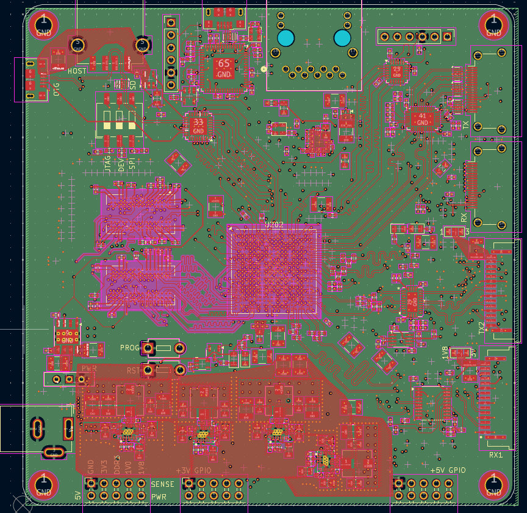
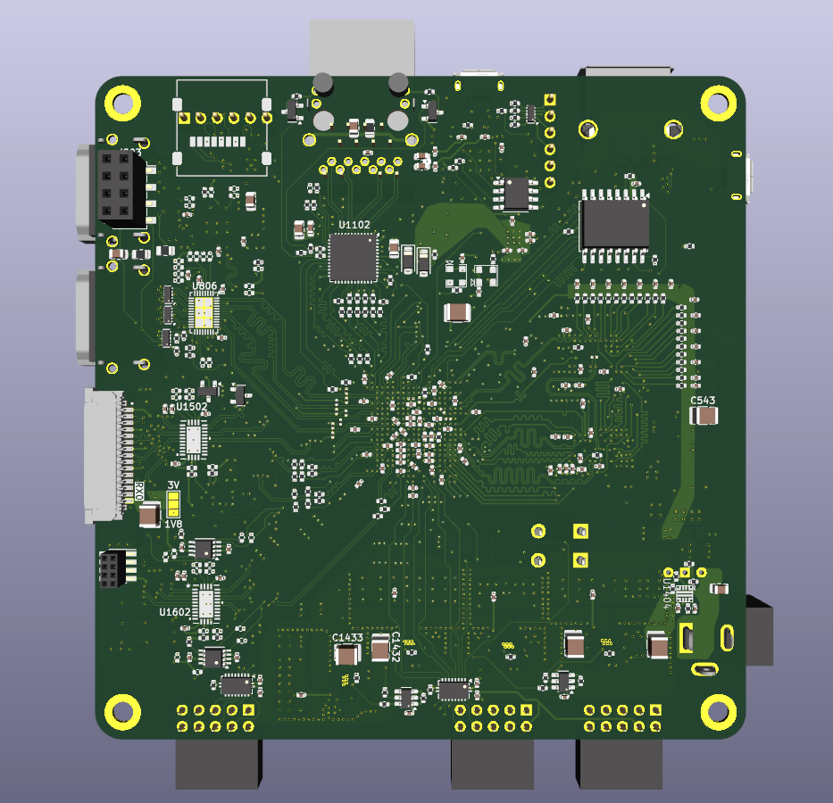

# Zynq-7020 Vision Test Board
Test board for the Zynq 7020. This is mainly for my practice/learning more advanced pcb design.

Features:
* USB OTG (Host/Device)
* Ethernet
* On board Programming via JTAG
* HDMI RX
* HDMI TX
* 2x CSI-2 RX
* 1x CSI-2 TX
* 1 Gbit Flash
* SD Card

## Schematics

Full Schmatics [here](./pcb/zynq_test/pdf/Zynqinator.pdf)